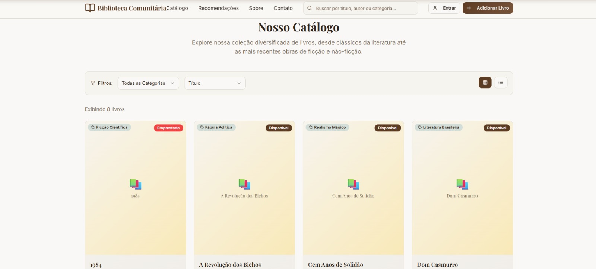

# 📚 Biblioteca Comunitária  

## 📌 Descrição do Projeto  
O projeto acadêmico desenvolvido para a Universidade Presbiteriana Mackenzie **Biblioteca Comunitária** tem como objetivo criar uma plataforma web simples e acessível para a comunidade local.  
A ideia é facilitar o acesso ao acervo de livros, divulgar eventos culturais e aproximar a comunidade da biblioteca.  

---

## 💡 Ideação  
O processo de ideação envolveu:  
- Identificação da necessidade de digitalizar o acesso à biblioteca.  
- Discussão em grupo sobre funcionalidades importantes.  
- Criação de protótipos iniciais para validar a proposta.  

---

## 🖼️ Protótipo Inicial  
Protótipo criado como base para o desenvolvimento:  

  
 

---

## 🌍 Caráter Extensionista  
Este projeto possui caráter extensionista pois conecta a universidade à comunidade:  
- Apoia o acesso à leitura e informação.  
- Gera impacto social positivo.  
- Incentiva o aprendizado colaborativo. 

## Integrantes

- Flávio Villardi Biscaro - RA: 10438367
- Miguel Batista da Silva – RA: 10736250
- Pedro Ferreira – RA: 10740749
- Raphael Squinzari – RA: 10737008

## 🛠️ Tutorial Explicativo – Funcionamento do Projeto

## Passo 1 – Estruturação da Página com HTML

O HTML cria as seções principais da biblioteca:

Catálogo para exibir livros.

Filtros e ordenação para facilitar busca.

Recomendações para destacar conteúdos.

Modal para detalhes adicionais.

Exemplo de um card de livro:

  
  

    <h3>O Senhor dos Anéis</h3>
    
Autor: J.R.R. Tolkien

    <button onclick="abrirModal()">Ver detalhes</button>
  

✔️ Cada livro tem uma categoria (data-categoria) usada no filtro.

## Passo 2 – Estilização com CSS

O CSS garante identidade visual e responsividade.
Exemplo: o card de livro tem sombra, bordas arredondadas e efeito de destaque:

.book-card {
  background: #fff8f0;
  border-radius: 12px;
  box-shadow: 0 4px 8px rgba(0,0,0,0.1);
  transition: transform 0.2s ease;
}

.book-card:hover {
  transform: translateY(-5px);
}

✔️ Isso melhora a usabilidade, pois o usuário percebe que o item é interativo.

Também existem media queries que adaptam o layout para tablet e celular:

@media (max-width: 768px) {
  .book-grid {
    grid-template-columns: 1fr;
  }
}

✔️ Isso garante que a biblioteca funcione bem em qualquer dispositivo.

## Passo 3 – Interatividade com JavaScript

O JavaScript torna a aplicação dinâmica.

Abrir modal de detalhes:

function abrirModal() {
  document.getElementById("modalDetalhes").style.display = "block";
}

Fechar modal:

function fecharModal() {
  document.getElementById("modalDetalhes").style.display = "none";
}

Filtrar livros por categoria:

function filtrarCategoria(categoria) {
  const livros = document.querySelectorAll(".book-card");
  livros.forEach(livro => {
    livro.style.display = (livro.dataset.categoria === categoria || categoria === "todos") 
      ? "block" 
      : "none";
  });
}

✔️ Assim, o usuário pode selecionar apenas “Romance”, “Ficção” ou visualizar todos os livros.

Ordenar livros por título:

function ordenarPorTitulo() {
  const container = document.querySelector(".book-grid");
  const livros = Array.from(container.children);

  livros.sort((a, b) => {
    const tituloA = a.querySelector("h3").textContent;
    const tituloB = b.querySelector("h3").textContent;
    return tituloA.localeCompare(tituloB);
  });

  livros.forEach(livro => container.appendChild(livro));
}

✔️ Isso organiza o catálogo alfabeticamente, ajudando na navegação.

## Passo 4 – Testando Responsividade

No desktop, a grade exibe 3 ou 4 livros lado a lado.

No tablet, os livros se ajustam para 2 colunas.

No celular, a visualização é em uma coluna única.

Isso foi possível graças ao grid + media queries do CSS.

## Passo 5 – Recomendações e Destaques

A seção de recomendações usa o mesmo modelo de cards, mas destacando livros indicados:

<section id="recomendacoes">
  <h2>📌 Recomendações</h2>
  

    <!-- cards especiais -->
  

</section>

✔️ Isso cria uma vitrine de livros selecionados pela biblioteca.
